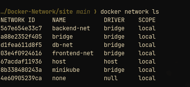
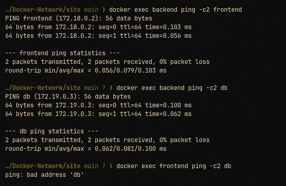
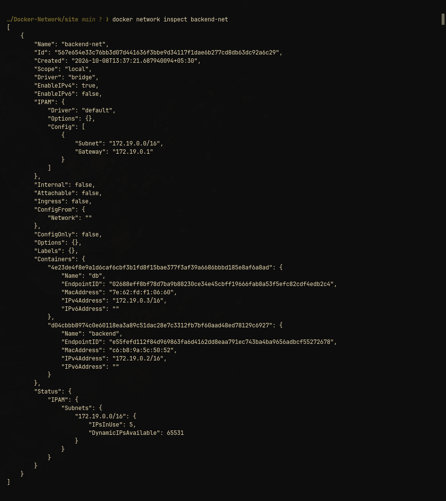
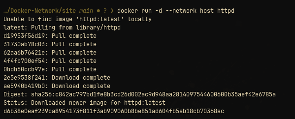
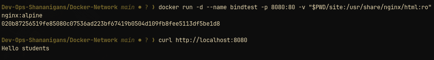
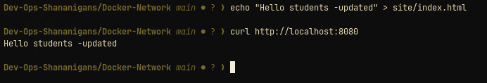

# Docker networking and volumes

This directory is a guided Docker lab for four concepts that are easy to confuse when learned only from diagrams:

1. Containers on user-defined bridge networks.
2. A container attached to more than one network.
3. Host networking.
4. Bind mounts and overlay networks.

The first three tasks can run on one Docker host. The overlay task needs Docker Swarm and, for the cross-host behavior, at least two Docker hosts.

## Prerequisites

- Docker Engine is running.
- Ports `80` and `8080` are available for the host-network and bind-mount checks.
- `curl` is available.
- Run the overlay section only on a disposable Swarm manager or test cluster.

## Task 1: user-defined networks

Create three networks and three containers:

```bash
docker network create frontend-net
docker network create db-net
docker network create shared-net

docker run -d --name homework-frontend --network frontend-net nginx:alpine
docker run -d --name homework-backend --network frontend-net alpine:3.20 \
  sh -c 'while :; do sleep 3600; done'
docker network connect db-net homework-backend

docker run -d --name homework-database --network db-net \
  -e MYSQL_ROOT_PASSWORD=homework mysql:8.4
docker network connect shared-net homework-frontend
docker network connect shared-net homework-database
```

The backend is attached to both `frontend-net` and `db-net`:

```bash
docker inspect -f '{{json .NetworkSettings.Networks}}' homework-backend
```


The frontend and database also share `shared-net`. Inspect network membership and test name resolution from the containers:

```bash
docker network inspect frontend-net
docker network inspect db-net
docker network inspect shared-net

docker exec homework-frontend ping -c 1 homework-backend
docker exec homework-frontend ping -c 1 homework-database
docker exec homework-backend ping -c 1 homework-frontend
docker exec homework-backend ping -c 1 homework-database
```




The expected ping result is one packet received for each check. The commands test Docker's embedded DNS and connectivity between attached containers.

Cleanup:

```bash
docker rm -f homework-frontend homework-backend homework-database
docker network rm frontend-net db-net shared-net
```

## Task 2: host networking

The official Apache image is `httpd`. With host networking, Apache binds directly to the host's port `80`; there is no `-p` mapping:

```bash
docker pull httpd:2.4
docker run -d --name homework-apache --network host httpd:2.4
curl -fsS http://localhost:80
```



Cleanup:

```bash
docker rm -f homework-apache
```

Host networking reduces isolation and can collide with services already listening on the host. Use it here to observe the difference, not as a default.

## Task 3: read-only bind mount

The fixture is [`site/index.html`](site/index.html). Start Nginx with the host directory mounted into its document root:

```bash
docker run -d --name bindtest -p 8080:80 \
  -v "$PWD/site:/usr/share/nginx/html:ro" \
  nginx:alpine

curl http://localhost:8080
```



The response contains `Hello students`. Change the host file while the container is running:

```bash
echo "Hello students -updated" > site/index.html
curl http://localhost:8080
```



The second response changes without rebuilding the image or restarting the container. The mount is read-only from the container's point of view, while the host can still update the source file.

Cleanup:

```bash
docker rm -f homework-nginx
git checkout -- Docker-Network/site/index.html
```

The last command restores the tracked fixture after the exercise. If the file has unrelated local edits, restore it manually instead of running that command.

## Task 4: overlay networks

An overlay network spans Docker hosts through Docker Swarm. A normal bridge network is local to one Docker host.

Run this only on a disposable Swarm manager:

```bash
docker swarm init
docker network create --driver overlay --attachable homework-overlay
docker service create --name homework-web --network homework-overlay nginx:alpine
docker service ls
docker network inspect homework-overlay
```

Join another Docker host with the worker command printed by `docker swarm init`, then scale the service:

```bash
docker service scale homework-web=2
docker service ps homework-web
```

The nodes must allow TCP `2377`, TCP/UDP `7946`, and UDP `4789` between them. Remove the lab when finished:

```bash
docker service rm homework-web
docker network rm homework-overlay
docker swarm leave --force
```

## Verification record

The repository's existing verification record reports successful local checks for:

- container connectivity across the user-defined networks;
- Apache through host port `80`;
- the bind-mounted file changing without an Nginx restart.

Overlay verification remains environment-dependent because it needs Swarm and, for cross-host behavior, multiple Docker hosts.

Related examples: [`Docker/README.md`](../Docker/README.md).
