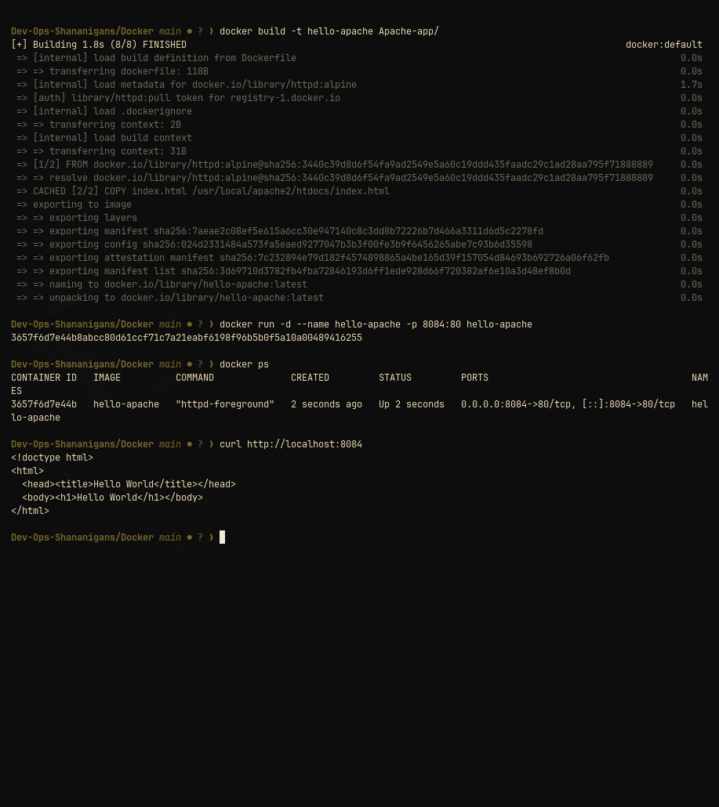

# Apache Hello World container

This image serves [`index.html`](index.html) with the official Apache HTTP Server image. Apache listens on container port `80`.

## Build and run

```bash
docker build -t hello-apache Docker/Apache-app
docker run --rm --name hello-apache -p 8081:80 hello-apache
```

Verify it:

```bash
curl -fsS http://localhost:8081/
```

Open [http://localhost:8081](http://localhost:8081) in a browser. Stop with `Ctrl+C`; `--rm` removes the container.



## Dockerfile notes

The Dockerfile uses `httpd:alpine` and copies the page to `/usr/local/apache2/htdocs/index.html`, Apache's default document root. No application runtime or package manager is involved.
