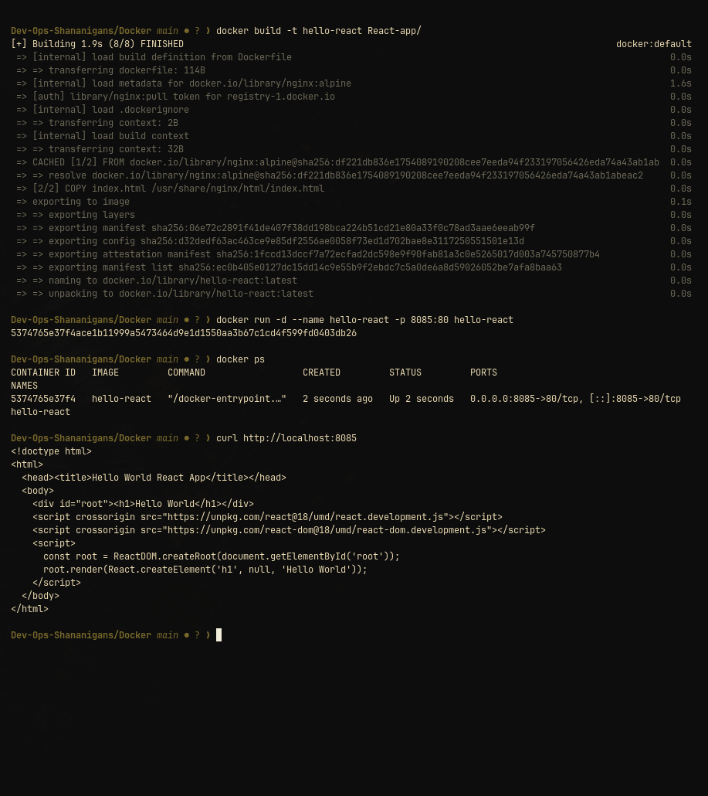

# React Hello World container

This is a deliberately small browser-side React example. [`index.html`](index.html) loads React 18 and ReactDOM 18 from `unpkg.com`, renders an `h1`, and is served as a static file by Nginx.

## Build and run

```bash
docker build -t hello-react Docker/React-app
docker run --rm --name hello-react -p 8082:80 hello-react
```

Verify it:

```bash
curl -fsS http://localhost:8082/
```

The HTML source contains `Hello World`; a browser with network access also runs the React render. Stop with `Ctrl+C`; `--rm` removes the container.



## Important limitation

There is no local React package, bundler, lockfile, or build step. The browser must reach `unpkg.com` after the page loads. This folder demonstrates the smallest possible React render, not an offline or production frontend build.
