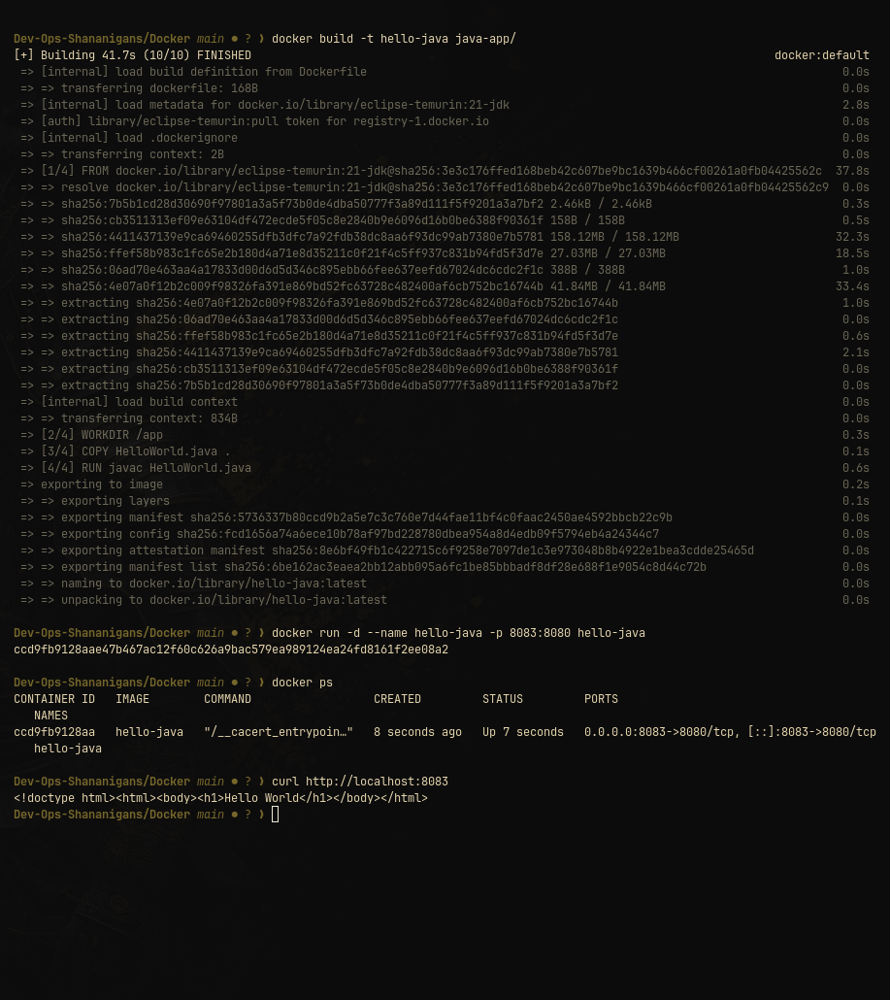

# Java Hello World container

This image compiles [`HelloWorld.java`](HelloWorld.java) with the JDK and starts it with the JDK's built-in `HttpServer`. The server listens on `0.0.0.0:8080`.

## Build and run

```bash
docker build -t hello-java Docker/java-app
docker run --rm --name hello-java -p 8080:8080 hello-java
```

Verify it:

```bash
curl -fsS http://localhost:8080/
```

The HTML response contains `Hello World`. Stop with `Ctrl+C`; `--rm` removes the container.

## Dockerfile notes

1. The image starts from `eclipse-temurin:21-jdk`.
2. `javac HelloWorld.java` compiles the source during the image build.
3. The default command runs the resulting `HelloWorld` class.

