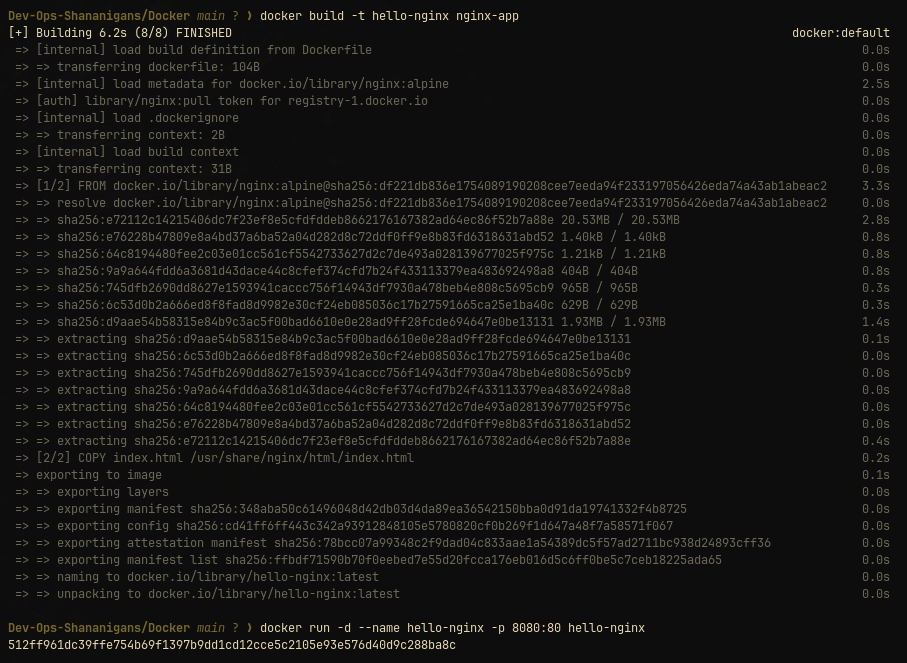
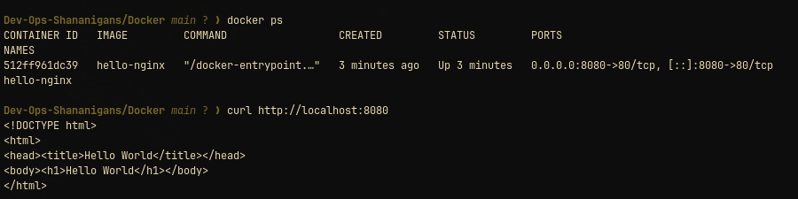

# Nginx Hello World container

This image serves [`index.html`](index.html) from the official Nginx image. Nginx listens on container port `80`.

## Build and run

```bash
docker build -t hello-nginx Docker/nginx-app
docker run --rm --name hello-nginx -p 8080:80 hello-nginx


```

Verify it:

```bash
curl -fsS http://localhost:8080/


```

Open [http://localhost:8080](http://localhost:8080) in a browser. Stop with `Ctrl+C`; `--rm` removes the container.

## Dockerfile notes

The Dockerfile copies the page to `/usr/share/nginx/html/index.html`, Nginx's default document root. The image does not need an application runtime or dependency install.
