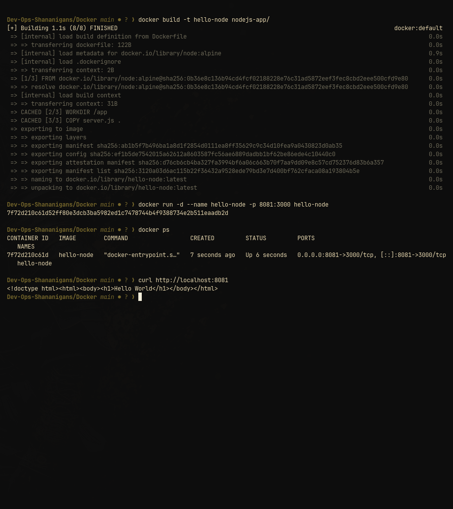

# Node.js Hello World container

This image runs [`server.js`](server.js), which uses Node.js's built-in `http` module. It listens on `0.0.0.0:3000` and returns a small HTML page for every request.

## Build and run

From the repository root:

```bash
docker build -t hello-node Docker/nodejs-app
docker run --rm --name hello-node -p 3000:3000 hello-node
```

Verify from another terminal:

```bash
curl -fsS http://localhost:3000/
```

Expected response contains `Hello World`. Stop the container with `Ctrl+C`; `--rm` removes it automatically.

## Dockerfile notes

- `node:alpine` supplies the runtime.
- The source file is copied into `/app`.
- No npm dependency or package manifest is needed.
- Port `3000` is documented with `EXPOSE` and published with `-p` at run time.


