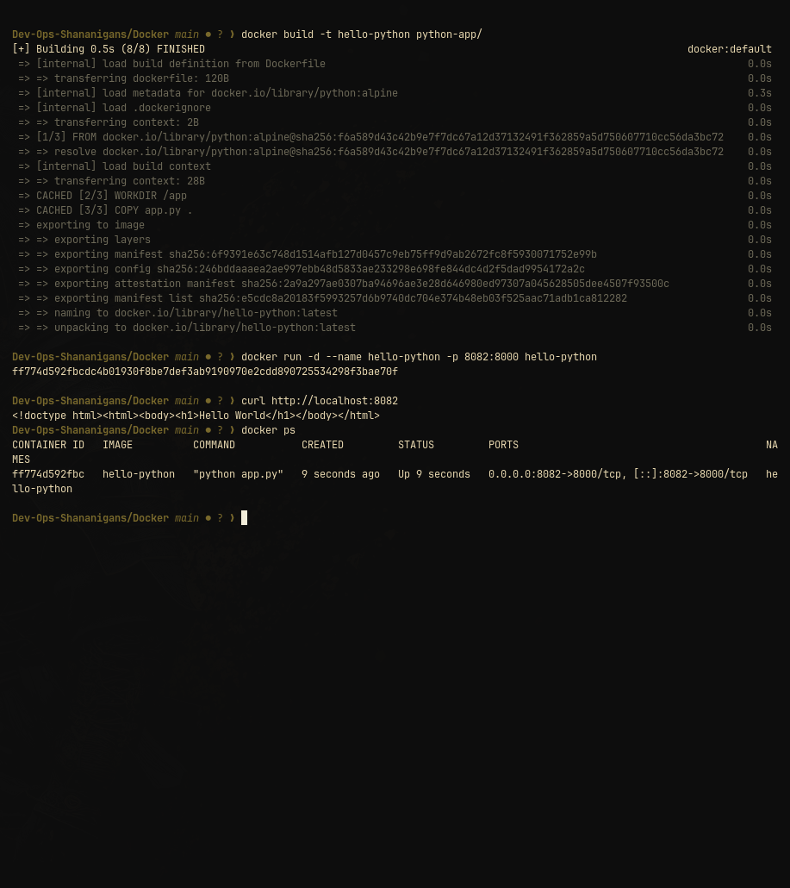

# Python Hello World container

This image runs [`app.py`](app.py), a small HTTP server built from Python's standard library. It listens on `0.0.0.0:8000` and responds with an HTML Hello World page.

## Build and run

```bash
docker build -t hello-python Docker/python-app
docker run --rm --name hello-python -p 8000:8000 hello-python
```

Verify it:

```bash
curl -fsS http://localhost:8000/
```

The response contains `Hello World`. Stop with `Ctrl+C`; the `--rm` flag removes the stopped container.

## Dockerfile notes

- `python:alpine` supplies Python and the Alpine base system.
- The application uses `http.server`, `BaseHTTPRequestHandler`, and `HTTPServer`.
- There are no third-party packages or dependency-install steps.
- The image documents port `8000`; Docker publishes it to the host with `-p`.


