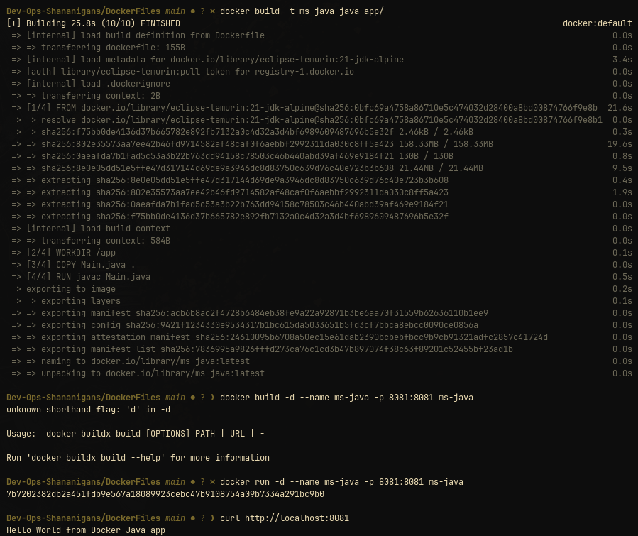
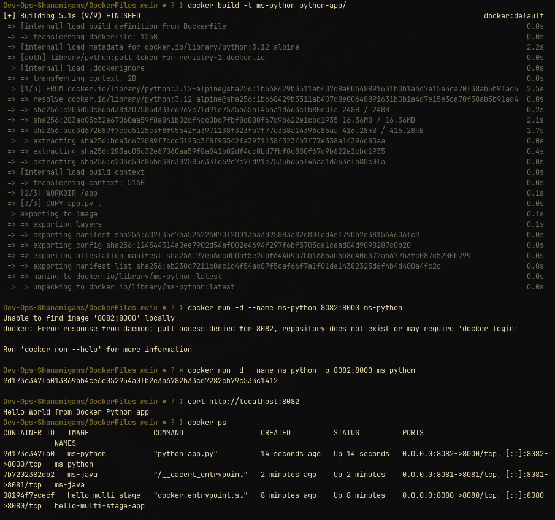
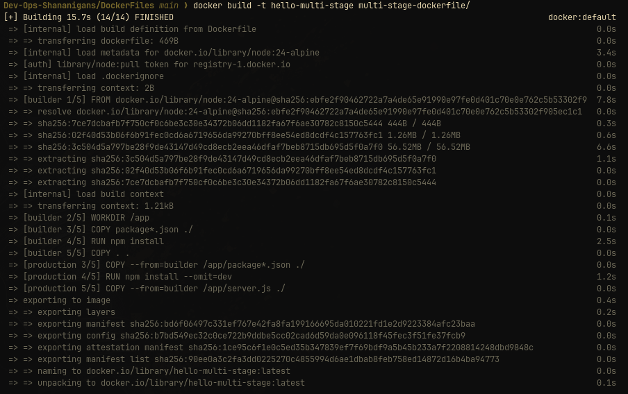
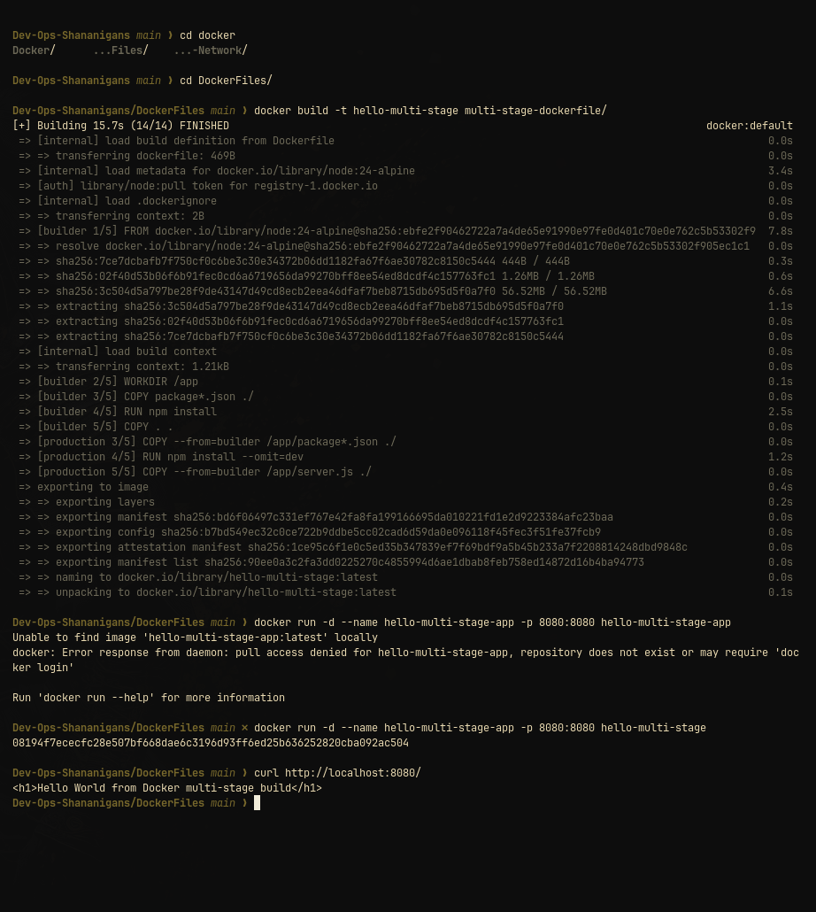
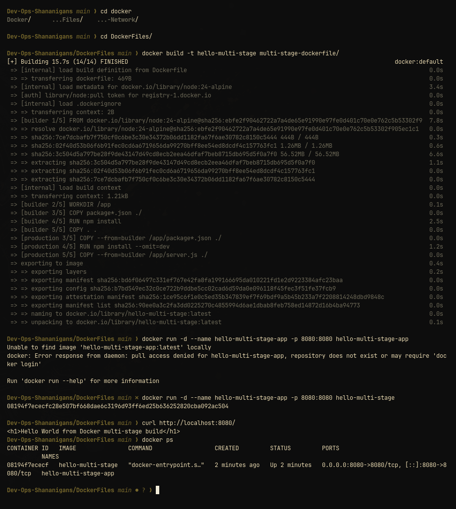
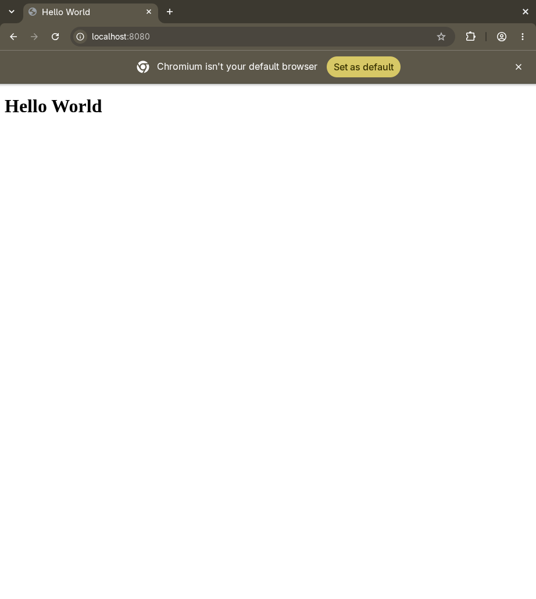

# DockerFiles exercises

This directory contains an earlier set of Dockerfile exercises. It is kept beside [`Docker/`](../Docker/) so the two approaches can be compared without changing the original assignment layout.

## Contents

| Directory | Demonstrates | Container port | Build |
|---|---|---:|---|
| [`multi-stage-dockerfile`](multi-stage-dockerfile/README.md) | Node.js build and production stages | 8080 | `docker build -t hello-multi-stage DockerFiles/multi-stage-dockerfile` |
| [`python-app`](python-app/README.md) | Python standard-library HTTP server | 8000 | `docker build -t hello-python DockerFiles/python-app` |
| [`java-app`](java-app/README.md) | Java JDK HTTP server | 8081 | `docker build -t hello-java DockerFiles/java-app` |
| [`Docker-Multi-Stage-Homework.md`](Docker-Multi-Stage-Homework.md) | Assignment notes and captured output | n/a | n/a |

## Run the examples

From the repository root:

```bash
docker build -t hello-multi-stage DockerFiles/multi-stage-dockerfile
docker run --rm --name hello-multi-stage-files -p 8080:8080 hello-multi-stage

docker build -t hello-python DockerFiles/python-app
docker run --rm --name hello-python-files -p 8000:8000 hello-python

docker build -t hello-java DockerFiles/java-app
docker run --rm --name hello-java-files -p 8081:8081 hello-java
```




Verify a running service with the matching port:

```bash
curl -fsS http://localhost:8080/
curl -fsS http://localhost:8000/
curl -fsS http://localhost:8081/
```




Run one service at a time if you want to reuse the host ports. Stop a foreground container with `Ctrl+C`; `--rm` removes it.

## Multi-stage assignment

[`Docker-Multi-Stage-Homework.md`](Docker-Multi-Stage-Homework.md) records a multi-stage build on port `8080` and the Python and Java examples on ports `8000` and `8081`. The assignment notes include captured `docker ps` and `curl` output.

## Cleanup

If you started named containers in the commands above:

```bash
docker rm -f hello-multi-stage-files hello-python-files hello-java-files
```

Only remove names created by this exercise.
