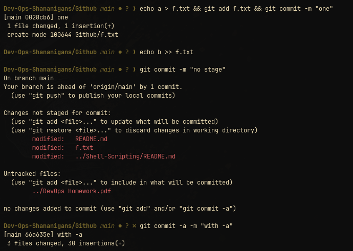

# Git and GitHub exercise

This directory holds the artifacts for a Git cherry-pick exercise. The screenshots show the completed command sequence, while the text files provide small working-tree fixtures.

## Directory layout

| Path | Purpose |
|---|---|
| [`ss/image1.png`](ss/image1.png) | First captured Git/GitHub exercise screenshot |
| [`ss/image2.png`](ss/image2.png) | Second captured screenshot |
| [`file1.txt`](file1.txt) | Small text file used as a change fixture |
| [`file2.txt`](file2.txt) | Empty text file used as a second fixture |
| [`mocks/`](mocks/README.md) | Three mock files for practicing file changes |

## Cherry-pick practice

The repository does not record the original commit IDs in this directory, so use the current history to choose a disposable source and target branch:

```bash
git log --oneline --decorate --all
git switch -c cherry-pick-practice
```

Create or identify a commit on a separate branch, then apply it to the practice branch:

```bash
git cherry-pick <commit-sha>
git log --oneline --decorate -5
```

If a conflict occurs, inspect the conflicted files, resolve them, stage the result, and continue:

```bash
git status
git add <resolved-file>
git cherry-pick --continue
```

To abandon the in-progress cherry-pick:

```bash
git cherry-pick --abort
```

Do not use the exercise branch for unrelated work. A disposable branch makes the result easy to remove without changing `main`.

## What to inspect

After the cherry-pick, check both the commit and the working tree:

```bash
git show --stat --oneline HEAD
git diff HEAD^ HEAD
git status --short
```

The screenshots are evidence from the original exercise, not a replacement for checking the commands against the current repository.

## Screenshots

### Cherry-pick on `main`


The second cherry-pick (`88b456e`) hit a modify/delete conflict on the `mocks` files. I resolved it with `git add .` and `git cherry-pick --continue`, and `git log --oneline` then showed the commit on `main`.

## `git commit -a -m` vs `git commit -m`

| Command | Behaviour |
|---|---|
| `git commit -m "msg"` | Commits only what is already staged with `git add`. With nothing staged it reports "nothing added to commit". |
| `git commit -a -m "msg"` | Stages all modified and deleted **tracked** files, then commits. New (untracked) files are not included. |


```
