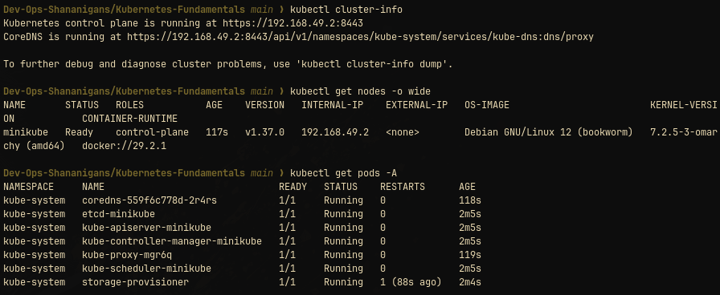
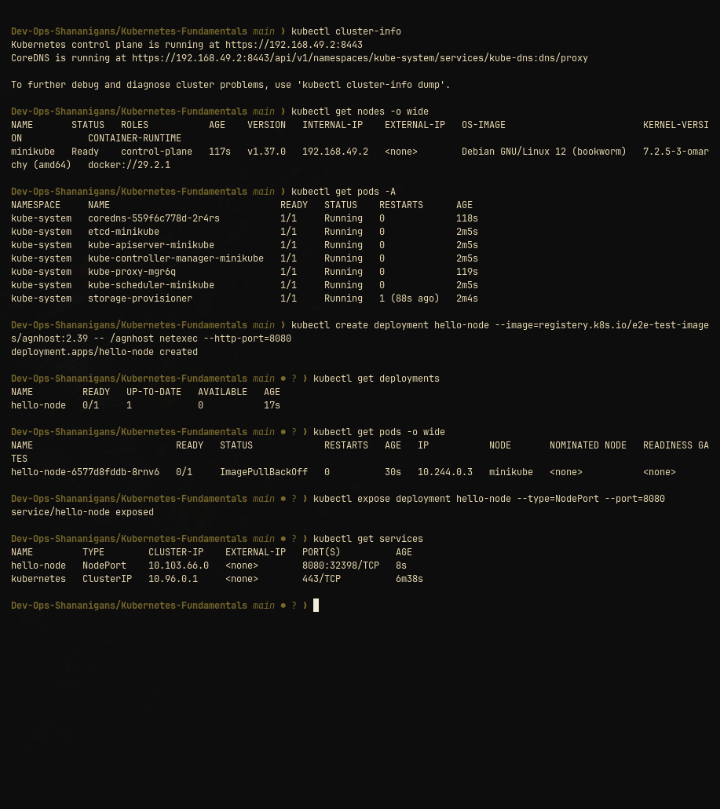
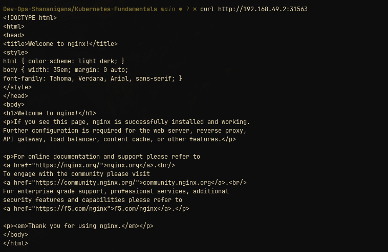

# Kubernetes Fundamentals

Cluster setup, health checks, and control-plane/worker-node architecture.

## Exercises

- `Cluster Health/`: local cluster baseline checks.
- `Cluster Architecture/`: control plane and worker node notes.
- Install and verify `minikube` and `kubectl`.
- Start, inspect, and stop a local cluster.
- Document the control plane, worker node, API objects, and `etcd`.
## Hands-on Verification & Screenshots

### 1. Cluster Status & Architecture
Minikube started successfully, control plane components (`kube-apiserver`, `etcd`, `coredns`, `kube-controller-manager`, `kube-scheduler`) are running in `kube-system`, and node `minikube` is in `Ready` state.

### 2. Workload & Service Deployment
Deploying an application via Deployment and exposing it with a `NodePort` service:

### 3. Service Access Verification
Accessing the exposed NodePort service via curl returns `HTTP 200 OK` from Nginx:

## References & Documentation
- [Kubernetes Basics Tutorial](https://kubernetes.io/docs/tutorials/kubernetes-basics/)
- [Minikube Start Guide](https://minikube.sigs.k8s.io/docs/start/)
- [Kubernetes Architecture Concepts](https://kubernetes.io/docs/concepts/architecture/)
