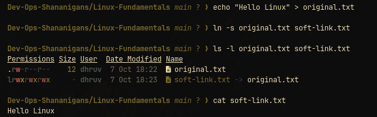
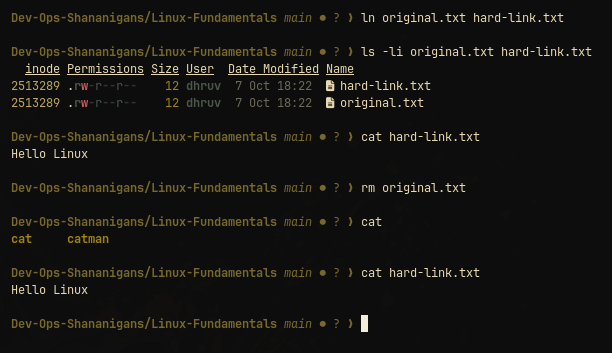
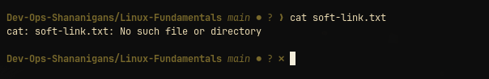
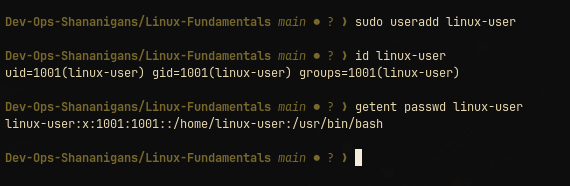
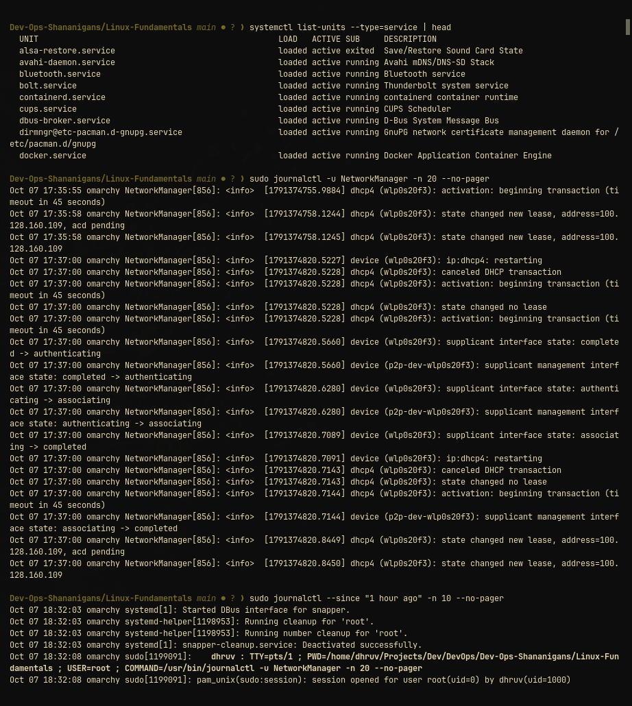

# Linux fundamentals

This directory is a compact practice guide for links, user creation, systemd journal inspection, and everyday command-line work. Run the examples in a test directory, virtual machine, or disposable account.

Commands beginning with `sudo` need administrator access. Read a command's manual before using it on a machine that matters.

## 1. Soft links and hard links

A symbolic link stores a pathname. It can point to a directory and cross filesystems, but it breaks when its target path disappears:

```bash
echo "hello Linux" > original.txt
ln -s original.txt soft-link.txt
ls -l original.txt soft-link.txt
cat soft-link.txt
```



`ls -l` shows `soft-link.txt -> original.txt`, and `cat` reads the original content through the link.

A hard link is another directory entry for the same inode. Removing one name leaves the data available through the other name:

```bash
ln original.txt hard-link.txt
ls -li original.txt hard-link.txt
rm original.txt
cat hard-link.txt
```



`ls -li` shows the same inode (`2513289`) for both names. After `rm original.txt`, `cat hard-link.txt` still prints the content.

After the original is deleted, the soft link is broken:

```bash
cat soft-link.txt
```



`cat` fails with `No such file or directory`, because the symlink only stores a path.

| Type | Points to | Usually crosses filesystems? | Can target a directory? |
|---|---|---:|---:|
| Symbolic link | A pathname | Yes | Yes |
| Hard link | The same inode/data | No | No |

Interview answer: a symbolic link points to a path and can break; a hard link points to the same inode and survives removal of the original name.

## 2. `adduser` and `useradd`

Both create users, but they serve different workflows:

| Command | Role | Typical use |
|---|---|---|
| `adduser` | Interactive distribution wrapper | Creating a normal user on Ubuntu/Debian |
| `useradd` | Low-level account utility | Scripts and precise account setup |

`adduser` and `deluser` are Debian/Ubuntu wrappers and are not installed on every distribution (they are missing on Arch, where this was tested), so `useradd` and `userdel` are used here. On Ubuntu the preferred command is `sudo adduser <name>` (interactive, creates the home directory and prompts for a password).

Create and remove a disposable practice account:

```bash
sudo useradd linux-user          # add -m to also create the home directory
id linux-user
getent passwd linux-user
sudo userdel -r linux-user       # -r removes the home directory and mail spool
```



`id` shows the uid/gid (1001) and `getent passwd` shows the `/etc/passwd` entry. Without `-m`, `useradd` does not create `/home/linux-user`, which is why `userdel -r` later warned that the home directory was not found.

Check the target account and home directory before removing anything on a real system.

## 3. `journalctl`

`journalctl` reads logs collected by `systemd-journald`. These commands cover the common inspection patterns:

```bash
sudo journalctl -b
sudo journalctl --since today
sudo journalctl -u NetworkManager -n 20 --no-pager
sudo journalctl --since "1 hour ago" -n 10 --no-pager
sudo journalctl -u NetworkManager -f
```



`systemctl list-units --type=service` lists services, `-u <unit> -n 20` shows the last 20 log lines of one service, and `--since` shows recent system-wide entries.

The unit name differs between distributions (for example `ssh` on Ubuntu). List service units when needed:

```bash
systemctl list-units --type=service
```

Press `q` to leave the normal log view and `Ctrl+C` to stop a live view.

## 4. Command reference

| Command | Purpose | Example |
|---|---|---|
| `pwd` | Show the current directory | `pwd` |
| `ls` | List files | `ls -la` |
| `cd` | Change directory | `cd /var/log` |
| `mkdir` | Create a directory | `mkdir practice` |
| `touch` | Create an empty file | `touch notes.txt` |
| `cp` | Copy files | `cp notes.txt backup.txt` |
| `mv` | Move or rename files | `mv backup.txt old-notes.txt` |
| `rm` | Delete files | `rm old-notes.txt` |
| `cat` | Print file contents | `cat notes.txt` |
| `less` | Read a file by screen | `less /var/log/syslog` |
| `grep` | Search text | `grep error app.log` |
| `find` | Find files | `find . -name '*.log'` |
| `man` | Open a manual | `man journalctl` |
| `whoami` | Show the current user | `whoami` |
| `id` | Show user and group IDs | `id` |
| `chmod` | Change permissions | `chmod 600 secret.txt` |
| `df` | Show free disk space | `df -h` |
| `du` | Show directory size | `du -sh .` |
| `ps` | Show running processes | `ps aux` |
| `systemctl` | Manage systemd services | `systemctl status ssh` |

Be especially careful with `rm` and commands run with `sudo`.
