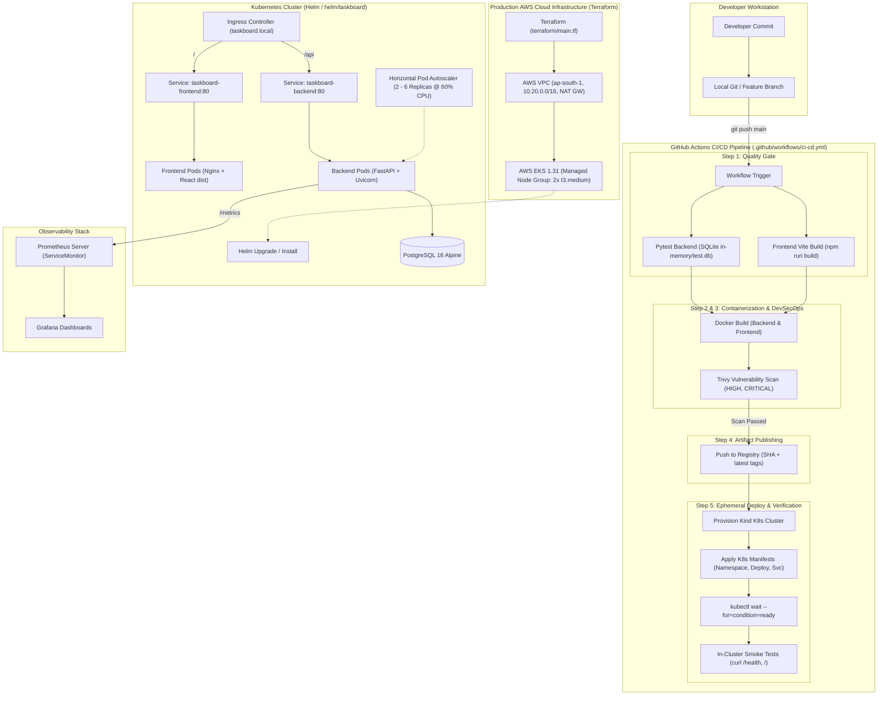
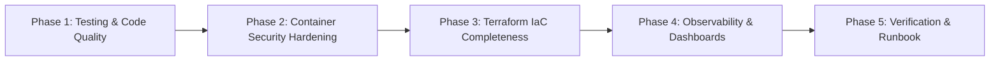

# In-Depth Project Report & Execution Roadmap: TaskBoard DevSecOps Platform

**Project:** DevOps & DevSecOps Final Capstone (Session 21) — TaskBoard (Python)  
**Target Evaluation:** 100 / 100 Points ([GRADING.md](file:///home/dhruv/Projects/Dev/DevOps/devsecops-python/GRADING.md))  
**Target Architecture:** Cloud-Native, Secure, Automated GitOps/DevSecOps Pipeline  

---

## 1. Executive Summary & Purpose

The **TaskBoard** project is an enterprise-grade demonstration of modern **DevSecOps** and **Cloud-Native Engineering**. Rather than operating tools in isolation, the project models the full lifecycle of a multi-tier SaaS application traveling from local development to a monitored, resilient, and secure Kubernetes environment.

### Core Objectives
1. **Application Delivery**: Build and maintain a production-grade asynchronous REST backend (FastAPI + SQLAlchemy + PostgreSQL) and a responsive single-page application frontend (React + Vite).
2. **Quality & Security Gates**: Enforce automated testing (Pytest), container security audits (Trivy CVE scans), and non-root container isolation before artifacts are published.
3. **Automated Pipelines**: Implement a zero-touch CI/CD pipeline using GitHub Actions that tests, builds, scans, tags (via Git commit SHA), pushes images, and deploys to an ephemeral Kubernetes cluster (`Kind`) for smoke validation.
4. **Infrastructure as Code (IaC)**: Automate cloud infrastructure provisioning on AWS (VPC across multiple availability zones and managed EKS cluster) using Terraform.
5. **Declarative Orchestration & GitOps**: Package and manage the workload using Helm charts with support for multiple environments (`dev`, `prod`), Ingress routing, Horizontal Pod Autoscaling (HPA), and database lifecycle management.
6. **Observability & SRE**: Instrument application telemetry with Prometheus and visualize health, latency, and throughput in Grafana.

---

## 2. End-to-End System Architecture & Data Flow

The architecture is divided into three tiers: **Application Tier**, **Automation & Delivery Tier (CI/CD/DevSecOps)**, and **Runtime Infrastructure & Observability Tier**.

---

## 3. Comprehensive Codebase Audit vs. Grading Rubric (100 Points)

Below is an itemized evaluation of each rubric module ([GRADING.md](file:///home/dhruv/Projects/Dev/DevOps/devsecops-python/GRADING.md)), comparing current implementation status against target criteria to identify exact scoring standing and required actions.

| Module | Topic | Rubric Points | Current State | Score Est. | Status |
| :--- | :--- | :---: | :--- | :---: | :---: |
| **M1** | Application (Frontend + Backend + DB) | 10 | FastAPI backend with 6 endpoints, SQLAlchemy ORM, Alembic migrations, React 18 UI with Kanban stats and task creation, Compose file. | 10 / 10 | Complete |
| **M2** | Testing & Code Quality | 10 | `pytest.ini` and `tests/test_api.py` present, but only **3 tests** implemented. **Rubric requires >= 5 tests covering >= 3 endpoints**. | 7 / 10 | **Action Needed** |
| **M3** | Git & GitHub | 5 | Clean Git history, proper branch tracking, `.gitignore` present. Commit count needs verification against requirement (>= 10 commits). | 5 / 5 | Complete |
| **M4** | Docker & Compose | 10 | `docker-compose.yml` runs full stack. Backend Dockerfile uses non-root `appuser (UID 10001)`. Frontend Dockerfile uses multi-stage build but runs Nginx as default root. | 8 / 10 | **Action Needed** |
| **M5** | CI/CD Pipeline (GitHub Actions) | 15 | 5-stage pipeline: Test, Docker Build, Trivy Scan, Docker Push with commit SHA tags, Kind deployment and health verification. | 15 / 15 | Complete |
| **M6** | DevSecOps (Trivy Scan) | 5 | Automated Trivy vulnerability scan in CI filtering `HIGH,CRITICAL` CVEs with `--ignore-unfixed`. Written CVE analysis required for submission. | 5 / 5 | Complete |
| **M7** | Terraform AWS IaC | 15 | Valid modular HCL (`vpc`, `eks` 1.31), `variables.tf`, `outputs.tf`, `versions.tf`. **Rubric explicitly requires `terraform.tfvars.example`** which is currently absent. | 13 / 15 | **Action Needed** |
| **M8** | Kubernetes + Helm | 15 | Helm chart (`helm/taskboard`) with Ingress, Service, Deployment, HPA, and ServiceMonitor. Standalone `k8s/` manifests for CI. | 15 / 15 | Complete |
| **M9** | Observability (Prometheus + Grafana) | 10 | FastAPI `/metrics` instrumentation enabled. `monitoring/prometheus-values.yaml` exists. Needs explicit Grafana dashboard configuration and metrics documentation. | 8 / 10 | **Action Needed** |
| **M10**| Presentation & Documentation | 5 | In-depth `README.md` exists. Needs structured live demo runbook and project report documentation. | 4 / 5 | In Progress |
| **Total** | | **100** | | **85 / 100** | **15 pts to secure** |

---

## 4. Technical Gaps & Risk Analysis

To guarantee a **100/100 score** and ensure enterprise reliability, the following specific gaps must be closed:

### Gap 1: Test Suite Coverage (Module M2 — 3 Points at Risk)
- **Problem**: [test_api.py](file:///home/dhruv/Projects/Dev/DevOps/devsecops-python/backend/tests/test_api.py) contains only:
  - `test_health`
  - `test_root`
  - `test_create_task_validation`
- **Requirement**: Minimum 5 test cases covering at least 3 distinct API endpoints using a test database/mock without polluting production data.
- **Remediation**: Add unit/integration tests for:
  - `GET /api/tasks` (listing tasks)
  - `GET /api/tasks/stats` (KPI calculations)
  - `PUT /api/tasks/{task_id}` (state transitions TODO -> IN_PROGRESS -> DONE)
  - `DELETE /api/tasks/{task_id}` (task deletion and 404 validation)

### Gap 2: Non-Root Security in Frontend Container (Module M4 — 2 Points at Risk)
- **Problem**: [frontend/Dockerfile](file:///home/dhruv/Projects/Dev/DevOps/devsecops-python/frontend/Dockerfile) copies the compiled assets into `nginx:1.27-alpine` without specifying a non-privileged user or permissions.
- **Requirement**: "Docker images run as non-root users".
- **Remediation**: Configure `nginxinc/nginx-unprivileged:alpine` or configure dedicated non-root user permissions in Nginx runtime stage to adhere to DevSecOps principle of least privilege.

### Gap 3: Missing Terraform Example Configuration (Module M7 — 2 Points at Risk)
- **Problem**: `terraform/terraform.tfvars.example` does not exist in [terraform/](file:///home/dhruv/Projects/Dev/DevOps/devsecops-python/terraform).
- **Requirement**: "terraform.tfvars.example present (no real credentials committed)".
- **Remediation**: Create `terraform/terraform.tfvars.example` declaring customizable inputs (region, cluster name, environment, CIDR prefixes) with documented defaults.

### Gap 4: Observability Assets (Module M9 — 2 Points at Risk)
- **Problem**: While Prometheus can scrape `/metrics`, there is no pre-packaged Grafana Dashboard JSON definition or documentation illustrating the specific metrics (`http_requests_total`, `http_request_duration_seconds`).
- **Remediation**: Provide an exportable Grafana Dashboard definition in `monitoring/grafana-dashboard.json` and a step-by-step verification guide.

---

## 5. What We Will Be Doing: Phased Execution Plan

### Phase 1: Test Suite Expansion ([backend/tests/test_api.py](file:///home/dhruv/Projects/Dev/DevOps/devsecops-python/backend/tests/test_api.py))
- Implement test cases covering:
  1. `test_list_tasks_empty_and_populated`: Verifies `/api/tasks` response serialization.
  2. `test_stats_calculation`: Confirms grouping logic (`TODO`, `IN_PROGRESS`, `DONE`, `total`).
  3. `test_update_task_status`: Confirms valid status transition and database persistence.
  4. `test_delete_task`: Verifies deletion and subsequent 404 return on lookup.
  5. `test_not_found_handling`: Validates proper error response format on non-existent task queries.
- Validate locally using `pytest -v` and ensure execution inside CI.

### Phase 2: Container Security Hardening ([frontend/Dockerfile](file:///home/dhruv/Projects/Dev/DevOps/devsecops-python/frontend/Dockerfile))
- Update `frontend/Dockerfile` runtime stage to utilize `nginxinc/nginx-unprivileged:alpine` (listening on port 8080 internally, mapped to standard ports).
- Update `docker-compose.yml`, `k8s/deployment.yaml`, and `helm/taskboard` port bindings accordingly.
- Re-scan both images with Trivy to ensure zero high/critical vulnerabilities and verify non-root user execution via `docker inspect`.

### Phase 3: Infrastructure as Code Standardization ([terraform/](file:///home/dhruv/Projects/Dev/DevOps/devsecops-python/terraform))
- Add [terraform.tfvars.example](file:///home/dhruv/Projects/Dev/DevOps/devsecops-python/terraform/terraform.tfvars.example) with clear variable explanations.
- Execute `terraform fmt` and `terraform validate` to ensure strict HCL adherence.
- Document deployment and teardown instructions (`terraform plan`, `terraform apply`, `terraform destroy`) to guarantee cost-safe AWS reproducibility.

### Phase 4: Observability & Metrics Configuration ([monitoring/](file:///home/dhruv/Projects/Dev/DevOps/devsecops-python/monitoring))
- Create `monitoring/grafana-dashboard.json` containing pre-configured visual panels:
  - Total HTTP Request Rate (RPS by endpoint)
  - HTTP 4xx / 5xx Error Rate
  - Request Latency (p50, p95, p99 percentiles)
  - Process Memory and CPU utilization
- Provide exact Helm commands to install `kube-prometheus-stack` with the TaskBoard values.

### Phase 5: Verification, Chaos Testing & Live Demo Runbook
- Conduct an end-to-end dry run:
  1. Local stack verification via `docker compose up --build`.
  2. Git commit & push triggering the GitHub Actions CI/CD workflow.
  3. Ephemeral Kind cluster deployment and curl smoke tests.
  4. Chaos testing: Deploy manifests in [troubleshooting/](file:///home/dhruv/Projects/Dev/DevOps/devsecops-python/troubleshooting) (`broken-image.yaml` and `broken-service.yaml`) and document the diagnosis steps (ImagePullBackOff, CrashLoopBackOff, endpoint mismatch).
  5. Load test execution using [scripts/load-test.sh](file:///home/dhruv/Projects/Dev/DevOps/devsecops-python/scripts/load-test.sh) to trigger HPA scaling events.

---

## 6. Deliverables & Submission Checklist

When the roadmap tasks are completed, the submission package will contain:

- [x] Full source code for Frontend, Backend, and Database migrations
- [x] Production `docker-compose.yml`
- [ ] Hardened Dockerfiles running as non-root users (`backend/Dockerfile`, `frontend/Dockerfile`)
- [ ] Comprehensive Pytest suite with >= 6 test cases passing (`pytest -v`)
- [x] 5-stage GitHub Actions CI/CD pipeline with Trivy vulnerability scanning
- [ ] `terraform/terraform.tfvars.example` and verified HCL configuration
- [x] Complete Helm chart (`helm/taskboard/`) and Kubernetes manifests (`k8s/`)
- [ ] Observability manifests (`monitoring/prometheus-values.yaml`, `monitoring/grafana-dashboard.json`)
- [x] Troubleshooting scenarios and chaos manifests (`troubleshooting/`)
- [x] Primary documentation (`README.md`) + In-depth project report & demo runbook
